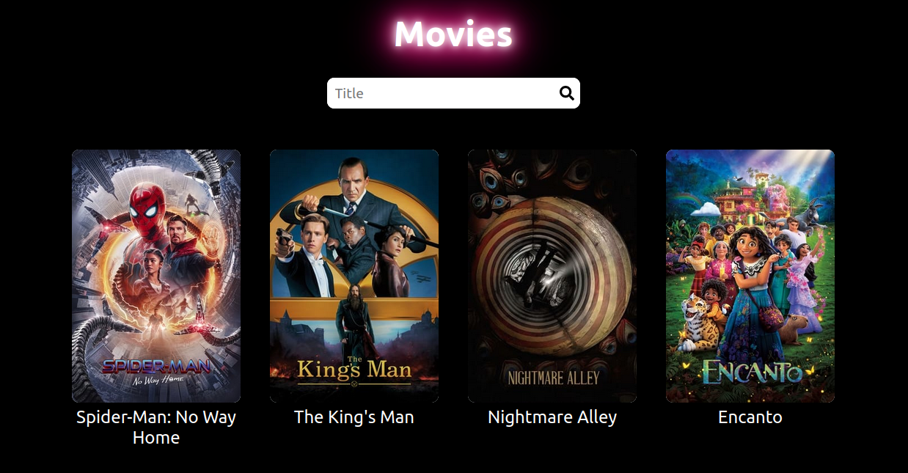

# Web de Peĺiculas

Es una web creada con react, para hacer uso de ella ejecutar
`npm install -g serve`
Ingresar todos los archivos una carpeta y ejecutan
`serve -s "nombre de la carpeta"`

Código en ReactJs
https://github.com/marcelo130102/Web_Peliculas_React
